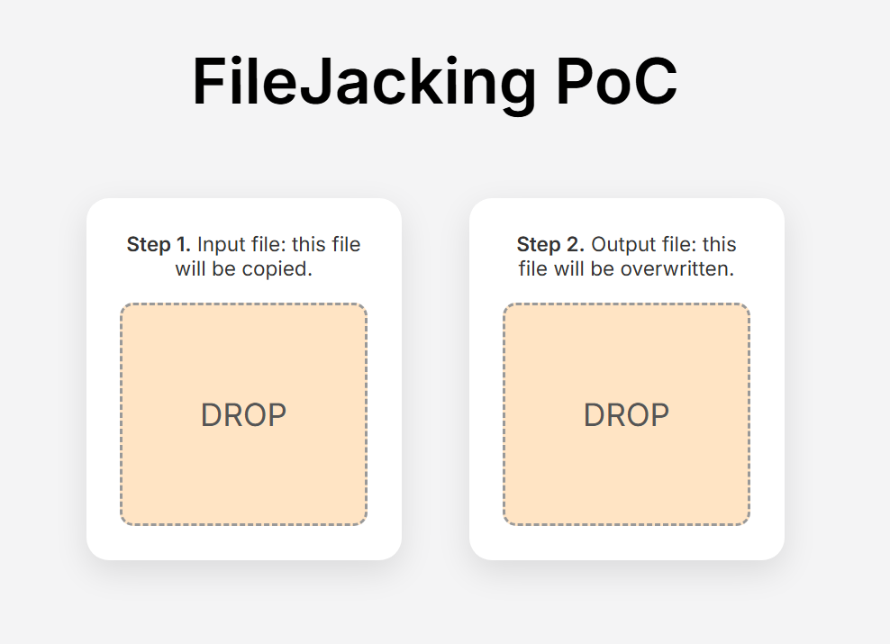

# FileJacking: Proof-of-Concept

**IMPORTANT**: If you don't know what this is all about read this article: [_FileJacking – Initial Access with File System API_](https://print3m.github.io/blog/filejacking-initial-access-with-file-system-api)

This simple PoC shows how to read and overwrite a user-selected file from the browser. This technique can be used in redteaming, for example, to backdoor an LNK file directly from the browser.

How to use:

1. Open `index.html` in Chromium-based browser.
2. Open DevTools -> Console.
3. Drop "input" file.
4. Drop "output" file.
5. Great. Now the output file is overwritten with the content of input file.

To use this in a real-world exercise, remove the “input” file reading feature and replace it with the hard-coded base64 content displayed in the console.

> **NOTE**: The Mark-of-the-Web (MOTW) is attached to the file after editing.
